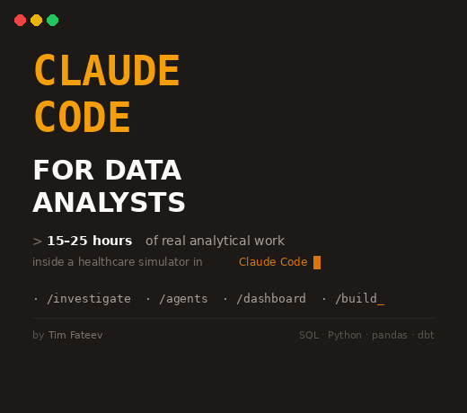

# Claude Code for Data Analysts

<p align="center">
  
</p>

**A hands-on simulator course. No videos. Everything inside Claude Code.**

You show up for your first day at EVE Health, a healthcare analytics company. Your manager pings you on Slack: *"Figure out the product before tomorrow's review."* And you do. You write SQL, analyze data in pandas, investigate anomalies, build dashboards, and present to leadership.

You don't watch. You work.

---

## What is this

A course simulator that runs entirely inside [Claude Code](https://docs.anthropic.com). No videos, no quizzes, no LMS. You open the terminal, type `/start-1-1`, and your first day at a fictional company begins.

Every module is a real work situation. Your manager assigns a task. You solve it with Claude Code: writing queries, analyzing data, building charts, investigating metric spikes, preparing presentations for executives.

Claude Code isn't just a tool in this course. It **is** the course.

---

## Quick Start

1. Download this repo (or `git clone`)
2. Open terminal in the course folder
3. Run `claude`
4. Type `/start-1-1`

**Requirements:** Claude Pro or Max subscription ($20/mo) + VS Code

---

## Course Structure

### Block 1: Fundamentals (10 modules)

| Module | Topic | You will... |
|--------|-------|-------------|
| 1.1 | First day at EVE Health | Meet the team, choose your level |
| 1.2 | Workspace setup | Set up editor + terminal + database |
| 1.3 | Monday morning digest | Analyze files, transform for 3 audiences |
| 1.4 | Parallel agents | Batch process 5 client datasets simultaneously |
| 1.5 | Metric spike investigation | Find why SLA breach jumped to 90% |
| 1.6 | Memory & handoff | Document your work for a colleague |
| 1.7 | Crisis mode | Fix analytics when pipeline breaks before board meeting |
| 1.8 | Skills | Build Excel reports + slide decks |
| 1.9 | Competitive benchmarking | Research competitors with web search |
| 1.10 | Build your own skill | Create a reusable analysis automation |

### Block 2: Core DA Work (4 modules)

| Module | Topic | You will... |
|--------|-------|-------------|
| 2.1 | Analysis brief | Frame the question before touching data |
| 2.2 | Data analysis | Synthesize surveys + usage logs + interviews |
| 2.3 | Insights deck | Present findings to the CEO |
| 2.4 | Dashboard spec | Design a dashboard a BI engineer will actually build |

### Block 3: Visual Content (2 modules)

Choose your track: **Advanced Data Visualization** (matplotlib, seaborn) or **AI Image Generation** (Gemini API). Senior does both.

### Block 4: Build a Product (5 modules)

Build an **ROI Calculator** for EVE Health's sales team, from idea to deployment on Vercel. You manage the product, Claude Code writes the code.

### Block 5: What's Next (2 modules)

MCP integrations with real data sources. Rolling out Claude Code to your analytics team.

---

## Three Difficulty Levels

You choose your level in Module 1.1. Every module adapts:

| | Junior (0-1 yr) | Middle (1-3 yr) | Senior (3+ yr) |
|---|---|---|---|
| **Code** | Ready made, you interpret | You write it yourself | You write both SQL and Python |
| **SQL** | SELECT, JOIN, GROUP BY | Window functions, CTEs | Complex CTEs, competing metrics |
| **Python** | pandas basics | pivot_table, matplotlib | numpy, statistical tests, seaborn |
| **dbt** | not included | not included | Models, tests, lineage |
| **Tone** | Supportive, step by step | Collegial, collaborative | Challenging, pushes back |
| **Time** | 15-30 min/module | 20-40 min/module | 30-60 min/module |

**Senior analysts do both SQL and Python in every module.** Not optional. That's the job.

---

## The Data

| Dataset | Records | Used in |
|---------|---------|---------|
| Support tickets | 2,672 | Modules 1.3, 1.5, 1.7, 2.4 |
| Platform usage | 8,000 | Modules 2.2, 2.4 |
| NPS survey | 320 | Module 2.2 |
| Client batches (×5) | ~1,000 | Module 1.4 |

All synthetic but realistic. Critical SLA breach at 90%. FCR below target. Unbalanced agent workload. This isn't "analyze a clean CSV." It's "figure out why everything is on fire."

---

## The Characters

| Name | Role | Personality |
|------|------|-------------|
| **Tim Fateev** | Head of Data & Analytics | Your manager. Supportive but data driven. Pings at 7:43 AM when something breaks. |
| **Marcus Webb** | Senior Data Scientist | Skeptic. Won't accept findings without a p-value. |
| **Priya Nair** | Data Engineer | Pragmatic. Will tell you "that query will timeout in prod." |
| **Bob Okafor** | BI Engineer | Owns the dashboards. Come with specs, not opinions. |
| **Jamie Liu** | Junior Analyst | Eager. Will Slack you at 11 PM asking if 0.3% is "significant." |

Plus 4 customer personas: a hospital CMO, a clinical data lead, a digital health VP, and an insurance actuary.

---

## Tech Stack

```
SQL (sqlite3) · Python · pandas · numpy · matplotlib · seaborn · dbt (Senior)
```

---

## About EVE Health

EVE Health Analytics is a fictional B2B healthcare analytics company (Series B, $18M raised, 84 customers, Austin TX). Their platform has three modules:

- **EVE Insights** pre-built dashboards for healthcare KPIs
- **EVE Explorer** self-serve analytics for non-technical staff (41% adoption, a problem you'll investigate)
- **EVE Signals** ML-powered anomaly detection (beta)

All company context, product docs, personas, and competitive analysis are in `company-context/`.

---

## License

**CC BY 4.0** use it, adapt it, share it. Just give credit.

---

## Author

**Tim Fateev** [LinkedIn](https://www.linkedin.com/in/tim-datapro/)

---

*You don't "take a course." You show up to work at an analytics team and solve problems that affect real metrics at a fictional but very believable company. At the end, you don't get a certificate. You get speed.*
